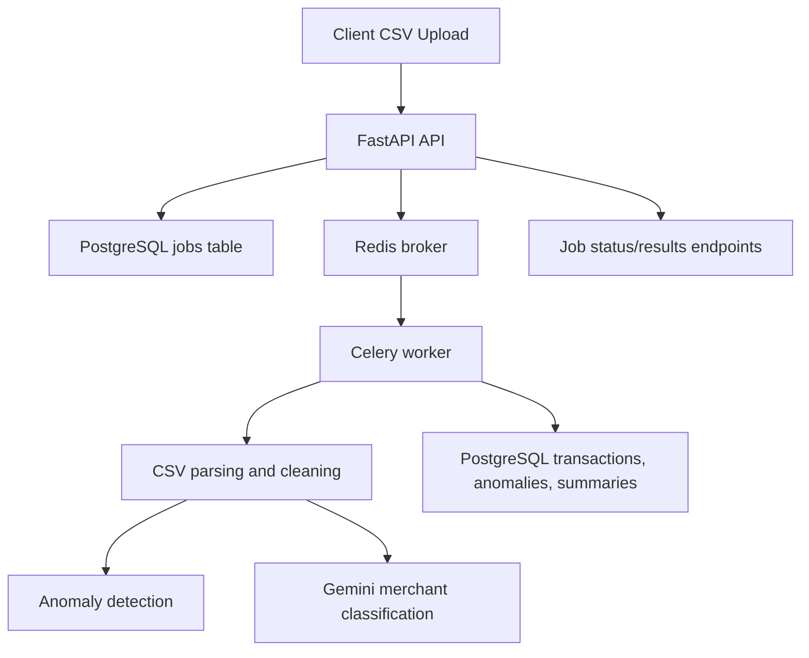

# Financial Transactions Analyzer

## Overview
Backend service that processes uploaded transaction CSV files, detects anomalies, classifies merchants with Gemini, and generates spending summaries.

## Tech Stack
- FastAPI
- PostgreSQL
- Redis
- Celery
- SQLAlchemy
- Alembic
- Pandas
- Docker
- Docker Compose
- Google Gemini API

## Local Setup

1. Copy example environment values:

```bash
cp .env.example .env
```

2. Build and start the stack:

```bash
docker compose up --build
```

3. Apply database migrations:

```bash
docker compose exec api alembic upgrade head
```

## Environment Variables

- `DATABASE_URL` - SQLAlchemy database URL for PostgreSQL
- `REDIS_URL` - Redis broker and backend URL
- `GEMINI_API_KEY` - Google Gemini service key
- `LOG_LEVEL` - logging level for FastAPI and Celery
- `ENVIRONMENT` - deployment environment

## API Endpoints

- `POST /jobs/upload`
- `GET /jobs/{job_id}/status`
- `GET /jobs/{job_id}/results`
- `GET /jobs`
- `GET /healthz`

## Example cURL Requests

Upload a CSV file:

```bash
curl -X POST "http://localhost:8000/jobs/upload" \
  -H "Content-Type: multipart/form-data" \
  -F "file=@sample.csv"
```

Check job status:

```bash
curl "http://localhost:8000/jobs/{job_id}/status"
```

Retrieve results:

```bash
curl "http://localhost:8000/jobs/{job_id}/results"
```

List all jobs:

```bash
curl "http://localhost:8000/jobs"
```

## Testing

Install development dependencies and run pytest:

```bash
python3 -m pip install -r requirements-test.txt
pytest -q
```

## Database Tables

- `jobs`
  - `id`
  - `status`
  - `created_at`
  - `completed_at`

- `transactions`
  - `id`
  - `job_id`
  - `account_id`
  - `date`
  - `merchant`
  - `amount`
  - `currency`
  - `category`
  - `status`

- `anomalies`
  - `id`
  - `transaction_id`
  - `anomaly_reason`

- `summaries`
  - `id`
  - `job_id`
  - `summary_json`

## Architecture



## Notes

- CSV processing is asynchronous via Celery.
- Missing merchant categories are classified by Gemini or defaulted to `Other`.
- Anomalies include large spend, domestic merchant using foreign currency, and suspicious duplicates.
